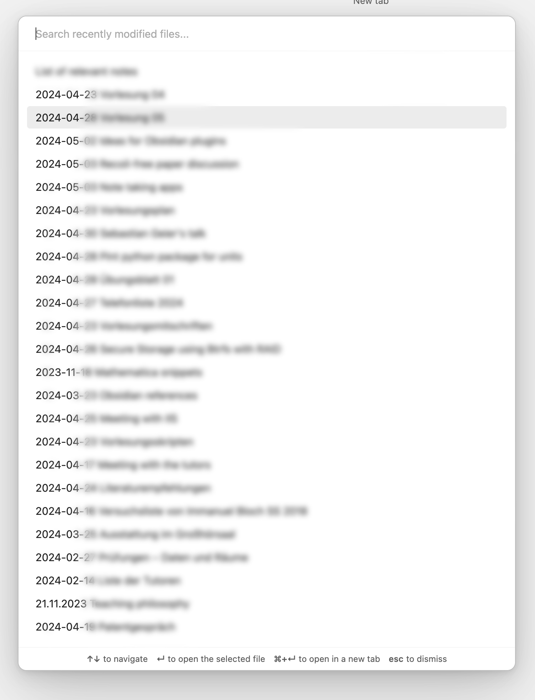

# Obsidian Dataview Recent files




# Export data types from Dataview

Download Dataview from GitHub `https://github.com/blacksmithgu/obsidian-dataview`.

Add the following file to the Dataview root folder:

```json
{
  "extends": "./tsconfig.json",  // Extend the base configuration
  "compilerOptions": {
    "declaration": true,
    "emitDeclarationOnly": true,
    "noEmitOnError": true,
    "outDir": "./dataview_types"  // Output directory for declaration files
  },
  "include": [
    "src/**/*.ts",
    "src/**/*.tsx"  // Include TypeScript and TSX files
  ],
  "exclude": [
    "node_modules",  // Exclude node_modules by default
    "**/*.test.ts",  // Exclude test files
    "**/*.test.tsx"  // Exclude TSX test files
  ]
}
```

and run the commands:

```bash
npx tsc -p tsconfig.declarations.json
```

Move the folder `dataview_types` to the `src` folder of this project.

# Donations
I would be grateful for any donation to support the development of this plugin.

[](https://buymeacoffee.com/alberti)

# Author
- **Author:** Andrea Alberti
- **GitHub Profile:** [alberti42](https://github.com/alberti42)
- **Donations:** [](https://buymeacoffee.com/alberti)

Feel free to contribute to the development of this plugin or report any issues in the [GitHub repository](https://github.com/alberti42/import-attachments-plus/issues).